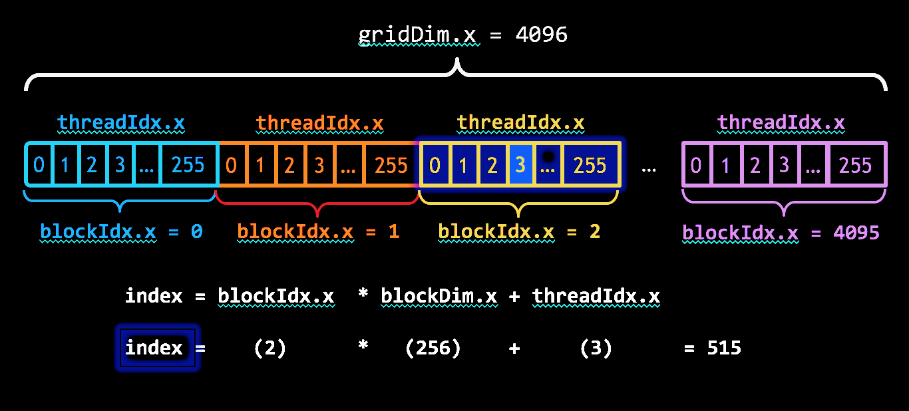

# CUDA

CUDA is a general-purpose parallel computing platform and programming
model developed by NVIDIA to leverage the massive parallel processing
power of GPUs.

CUDA's scalable programming model uses abstractions like thread group
hierarchies, shared memories, and barrier synchronization to enable
programs to automatically scale across various GPU architectures
by adjusting the number of multiprocessors and memory partitions.

## Binaries

The CUDA Toolkit provides the following binaries:

- `nvcc`: The CUDA compiler
- `nvprof`: The CUDA profiler
- `cuda-memcheck`: The CUDA memory checker
- `cuda-gdb`: The CUDA debugger
- `nsight-sys`: The CUDA system profiler
- `nsight-compute`: The CUDA kernel profiler

## Key Concepts and Terms

- The **host** is the CPU while the **device** is the GPU.
- grid-stride loops: A loop that iterates over all elements in a grid of threads

Acronyms that you should know:

- SIMD: Single Instruction, Multiple Data
- SIMT: Single Instruction, Multiple Threads (the CUDA execution model)
- SAXPY: Single-precision $A*X$ Plus $Y$

## CUDA C++ Programming

A kernel is a function that runs on the GPU. It is defined with the
`__global__` keyword and is called from the host code.

```cuda
__global__ void add(int *a, int *b, int *c) {
    int i = threadIdx.x;
    c[i] = a[i] + b[i];
}

int main()
{
    // ...
    // Kernel invocation with 1 block and $N$ threads
    VecAdd<<<1, N>>>(d_a, d_b, d_c);
    // ...
}
```

> [!NOTE]
> The `<<<...>>>` _execution configuration_ syntax is used to specify the
> number of blocks and threads to launch the kernel with.

## Thread Hierarchy

The `threadIdx` is a 3-component vector that holds the thread's index
within the block.



> [!NOTE]
> During execution there is a finer grouping of threads into _warps_.

## Global Memory Coalescing

The device _coalesces_ global memory loads and stores issued by threads
of a warp into as few transactions as possible to minimize DRAM bandwidth

## Thread Synchronization

Imagine a race condition where two threads are trying to
read and write to the same memory location...

CUDA provides a simple barrier synchronization primitive:
`__syncthreads()`

A thread's execution can only proceed past this barrier when all threads in the
block have reached it.

> [!CAUTION]
> Calling `__syncthreads()` in a conditional block (_divergent code_)
> can lead to a deadlock. Remember the four requirements for a deadlock:
>
> 1. Mutual exclusion
> 2. Hold and wait
> 3. No preemption
> 4. Circular wait

## SIMT Architecture

...

## Further Reading

- [CUDA Toolkit Documentation](https://docs.nvidia.com/cuda/index.html)
- [CUDA C++ Programming Guide](https://docs.nvidia.com/cuda/cuda-c-programming-guide/)

### Additional Resources

Blog:

- [Intro](https://developer.nvidia.com/blog/even-easier-introduction-cuda/)
- [Device Properties](https://developer.nvidia.com/blog/how-query-device-properties-and-handle-errors-cuda-cc/)
- [Global Memory](https://developer.nvidia.com/blog/how-access-global-memory-efficiently-cuda-c-kernels/)
- [Shared Memory](https://developer.nvidia.com/blog/using-shared-memory-cuda-cc/)
- [Efficient Matrix Transpose](https://developer.nvidia.com/blog/efficient-matrix-transpose-cuda-cc/)

TODO:

- [Performance metrics](https://developer.nvidia.com/blog/how-implement-performance-metrics-cuda-cc/)
- [Optimize data transfers](https://developer.nvidia.com/blog/how-optimize-data-transfers-cuda-cc/)
- [Overlap data transfers](https://developer.nvidia.com/blog/how-overlap-data-transfers-cuda-cc/)

Important!!!

- [Unified Memory](https://developer.nvidia.com/blog/unified-memory-cuda-beginners/)
