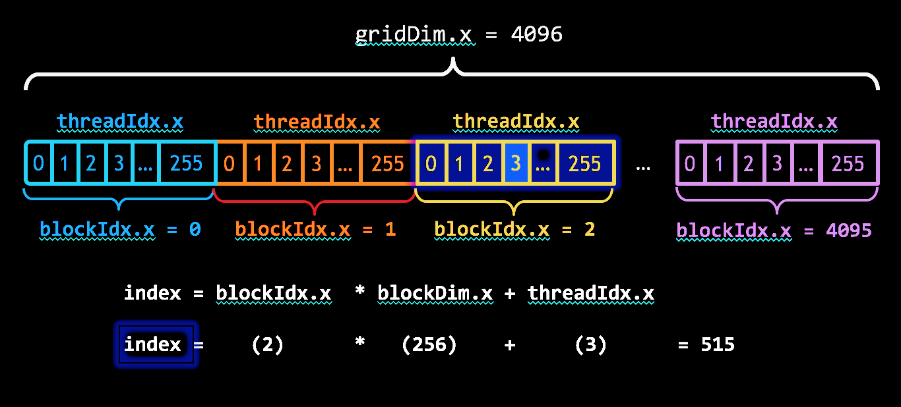

# Learn CUDA

## Introduction

01-add-vectors is a simple CUDA program that adds two vectors of integers. It is

### Profile it!

After compiling with `nvcc`, you can profile the program with `nvprof`:

```sh
nvprof ./add-vectors
```

## Stuff you should know

- `nvcc` is the CUDA compiler
- `nvprof` is the CUDA profiler
- `cuda-memcheck` is the CUDA memory checker
- `cuda-gdb` is the CUDA debugger

Terms:

- **Host**: The CPU
- **Device**: The GPU
- **Kernel**: A function that runs on the GPU
- **Device memory**: Memory on the GPU
- **Host memory**: Memory on the CPU
- **Unified memory**: Memory that is accessible from both the host and the
  device

Other stuff:

- grid-stride loops: A loop that iterates over all elements in a grid of
  threads
- SIMD: Single Instruction, Multiple Data
- SPMD: Single Program, Multiple Data
- **SIMT**: Single Instruction, Multiple Threads
- SAXPY: Single-precision $A*X$ Plus $Y$

## Thread hierarchy



> [!NOTE]
> During execution there is a finer grouping of threads into _warps_.

## Global Memory Coalescing

The device _coalesces_ global memory loads and stores issued by threads
of a warp into as few transactions as possible to minimize DRAM bandwidth

## Thread Synchronization

Imagine a race condition where two threads are trying to
read and write to the same memory location...

CUDA provides a simble barrier synchronization primative:
`__syncthreads()`

A thread's execution can only proceed past this barrier when all threads in the
block have reached it.

> [!CAUTION]
> Calling `__syncthreads()` in a conditional block (_divergent code_)
> can lead to a deadlock.

> [!TIP]
> Remember the four requirements for a deadlock:
>
> 1. Mutual exclusion
> 2. Hold and wait
> 3. No preemption
> 4. Circular wait
